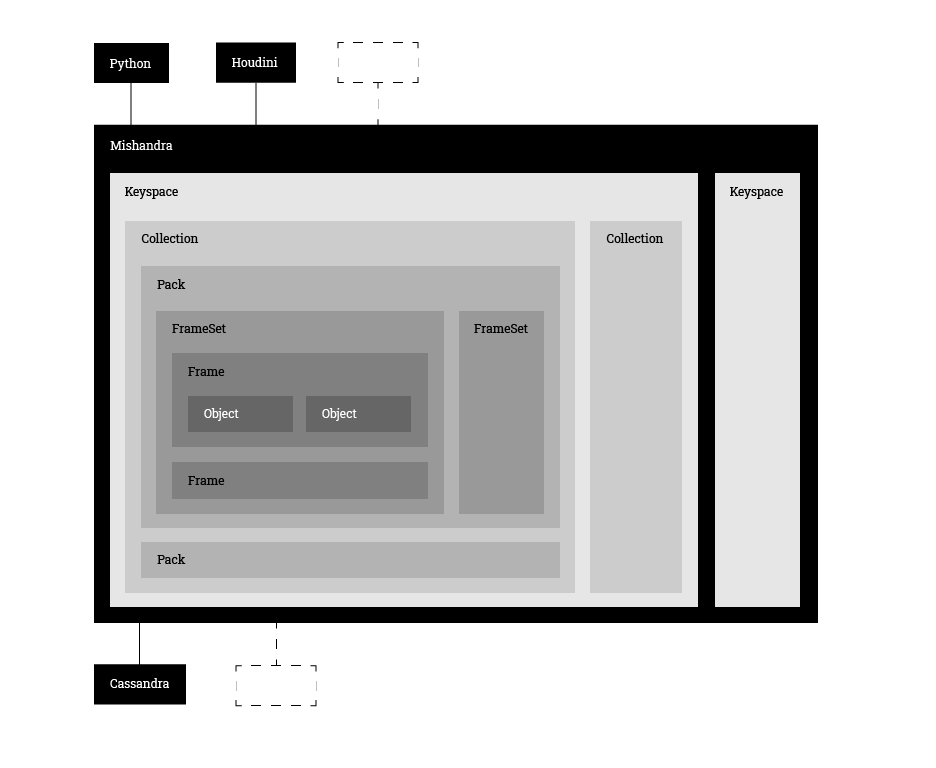

## Overview
Simple and flexible data representation.



Mishandra aims to simplify:
1. Data management in R&D workflows and production pipelines. 
2. Data iteroperability between content creation and machine learning tools.

### Supported interfaces
* [Python]
* [Houdini](https://www.sidefx.com/)
* [Blender](https://www.blender.org/) TODO
* [PyTorch](https://pytorch.org/) in progress

## Installation

### 1. Install Cassandra

#### Windows
1. Download the latest stable [Cassandra](https://cassandra.apache.org/download/), unpack and put it into a persistent directory.
2. Set ```%CASSANDRA_HOME%``` environment variable (e.g. ```C:\Program Files\apache-cassandra-3.11.6```).
3. Add ```%CASSANDRA_HOME%\bin``` to ```%PATH%```.
4. Download [Amazon Corretto](https://docs.aws.amazon.com/en_us/corretto/latest/corretto-8-ug/downloads-list.html) (JDK) and install it with default settings.

To start Cassandra, open PowerShell as administrator and run 
```
cassandra -f
```
If you get ```WARNING! Powershell script execution unavailable```, please run ```Set-ExecutionPolicy Unrestricted``` and try again.

#### Linux
TODO

### 2. Install Mishandra
Mishandra requires python 3.5+ in full configuration.
Mishandra inside Houdini works with python 2.7.

```
pip install git+https://github.com/knma/mishandra.git@master
```
You also need [ffmpeg](https://ffmpeg.org/download.html) installed on your system to run examples. Please don't forget to add it to ```PATH```.


## Sample Usage
Please take a look at notebooks in ```examples``` directory.
* [examples_python.ipynb](examples/examples_python.ipynb)
* [examples_houdini.ipynb](examples/examples_python.ipynb)

